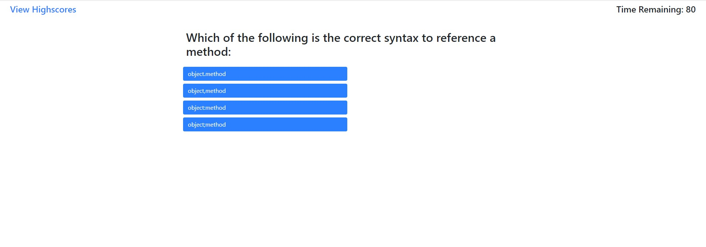

# js-quiz

## Introduction

The js-quiz website will ask 10 questions about JS and keep track of a score. While the quiz is being taken, a timer will be constantly updating to let the player know where they stand. When everything is done, the player will be prompted to put in their initials in order to keep track of high scores. The goal of this page is to build a foundation using web APIs to manipulate HTML and save user information.

## How-To

The user will click the Start Quiz button to begin the quiz. They will then need to answer a series of 10 questions while trying to save as much time as possible. For every incorrect answer, 10 seconds will get removed from the clock. Upon completion of the quiz, the user can input their intials to save their score. There is a link near the top of the page that takes you to an HTML page to show a list of the high scores.

## How it works

All elements are defined but assigned a display: none parameter. An onclick function is assigned to the start quiz button that will run the main quizBody function. This function will hide the intro page and remove the dispaly:none parameter from the main quiz portion of the test. The quizBody function will load a question into the HTML and start the timer. The timer has simple logic to prevent it from going into negatives and will run every 1000ms. 

The timer also has a callback function to check if the remaining time has run out or if the final question has been loaded to end the quiz. Upon disabling, the button elements will be disabled and removed. The finalScore function will then be called to add the display:none property to the quiz and remove the display:none from the end of the game scoring. Final score is calculated by using the following formula:

100 * (correctAnswer / totalQuestions) + timeRem

The scoring gives you your percentile by dividing the correct answers vs the total questions then multiplying it by 100. For example, 100 * (9/10) = 90. The time remaining is then added as bonus points on the end. 

The loadQuestion function creates a negative index which will be fixed when the first question loads. The system checks to see if there are any items left in the question arrary to end the quiz. If there are items still in the array, the function will continue. The function assigns a variable to the correct answer within the question array and adds to the totalQuestions counter.

Once the counter increases, the script will display the question title to the HTML and present the 4 options. An event listener is added to check if the user clicks on the right answer and then adds to the total number of correct answers or removes time from the clock.

The HTML page has a separate script to recall and display high scores.